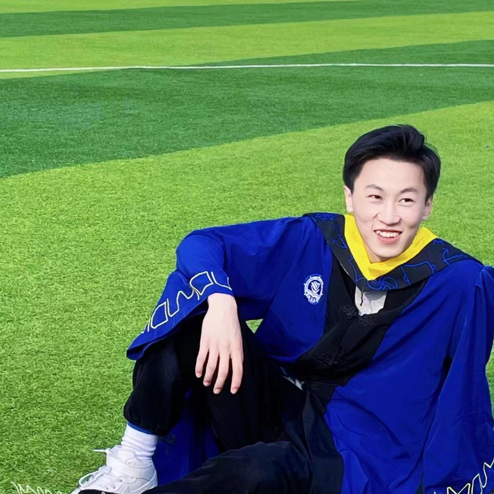

<b><big style="font-size: 28px;">XPilot Planning 开发团队</big></b>

 

## **Introduce:**
Hi, 我们是商汤科技的一个专注于研究自动驾驶决策规划算法与落地的团队。

这里我们将分享在无高精地图（w/o HDMap）场景下NOP功能的一些成果。

在2024.03.30会发布基于纯优化的决策规划方案。

预计2024年底，我们会发布v2.0版本，将展示在规划大模型方向的研究成果。

欢迎感兴趣的童鞋加入和关注我们。

 

## **Release:**
**Tag：v1.0 (2024.03.30)**
+ OpenSpace问题定义
+ 横纵向空间联合规划器
+ Risk-aware风险保护策略
+ 行为决策树
+ 横纵联合的变道行为决策

[v1.0 详细文档](doc/v1.0_doc.md)
 

## **Member:**

 **冯晓彤 sensetime@ai**

*Harbin Institute of Technology*

 

**程人 sensetime@ai**

*Peking University*

 
 

**奉山森 sensetime@ai**

*Hunan University*

 
 

**高宇辉 sensetime@ai**

*Dalian Maritime University*

 

**赵越 Ph.D sensetime@ai**

*Shanghai Jiao Tong University*

 

**联系方式：**

欢迎大家进行交流或加入我们。

**E-mail:** 

fengxiaotong.1994@gmail.com  fengxiaotong@senseauto.com
